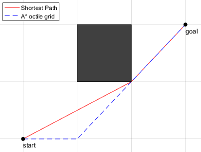

# Kiwi
Kiwi is a high-performance, client-side pathfinding bot for Minecraft 1.21+ (Fabric).

> [!IMPORTANT]
> Kiwi is in a very early stage of development. Expect missing features and rough edges.

---

## Features
### High-Performance Pathfinding
**Kiwi** utilizes the **[Theta*](https://en.wikipedia.org/wiki/Theta*)** pathfinding algorithm. Theta* allows the bot to traverse in any angle, not just 0° or 45° like A* would.
Here is a demonstration of this. On average this method is about 13% faster than basic A*.

### Goals
Kiwi has specific goals you can target:

- **GoalXYZ** a specific xyz coordinate
- **GoalNear** get into a range of an xyz coordinate
- **GoalXZ** a specific xz coordinate

## Usage
To get started, download the mod from the [releases page](https://github.com/0x1bd/Kiwi/releases).
> [!NOTE]
> Generally, it is recommended to download the latest stable version.

Then place the downloaded `kiwi-x.x.x.jar` file into your `mods` directory.

### Commands
Kiwi is mainly controlled through chat commands.
All commands are prefixed with `/kiwi`

Here is a small (and incomplete) overview of all commands:  
**`goal`** Start pathing to a goal.  
**`stop`** Stop all movement.  
**`config`** Configure kiwi.

## Special Thanks
- [Baritone](https://github.com/cabaletta/baritone/) (major inspiration)

## License
Kiwi is licensed under the **[GNU GPLv3](LICENSE.txt)**.