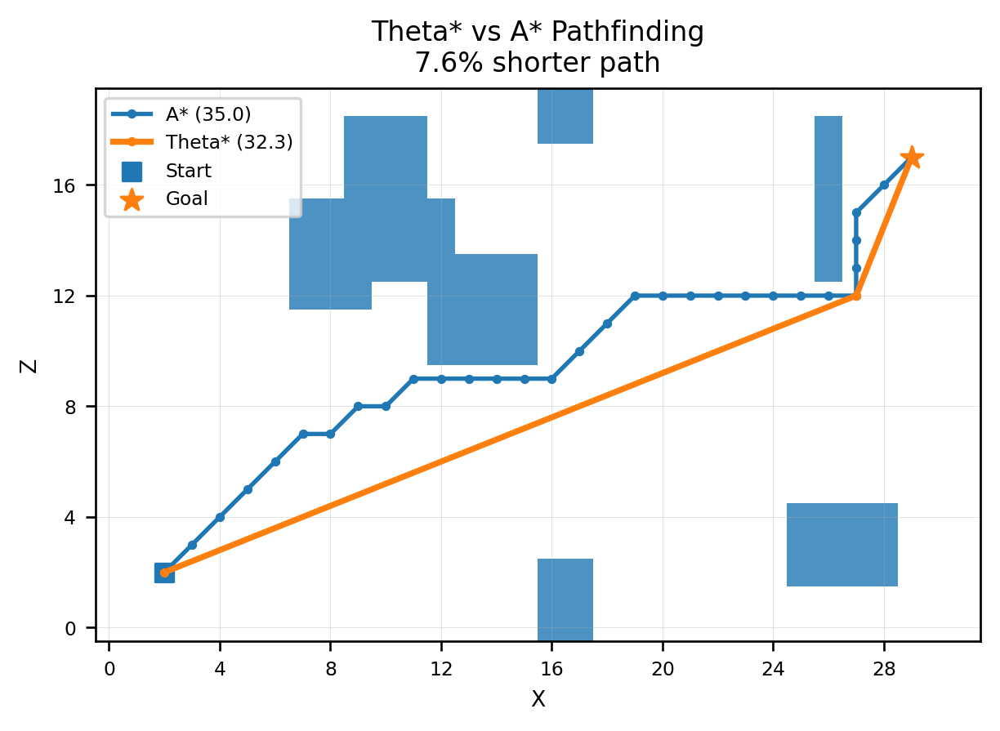
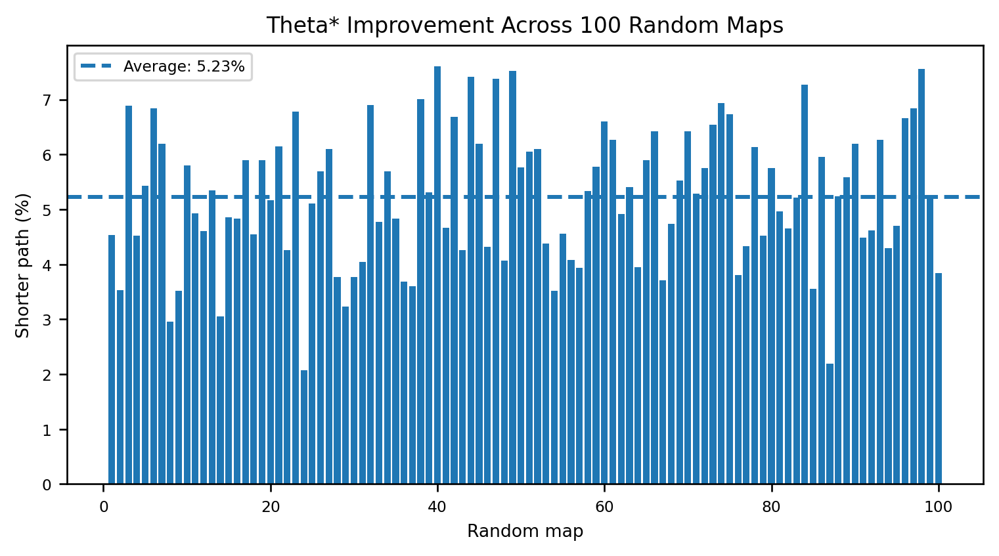

# Kiwi
Kiwi is a high-performance, client-side autonomous bot for Minecraft 26.1.2+ (Fabric).

> [!IMPORTANT]
> Kiwi is in a very early stage of development. Expect missing features and rough edges.

---

## Architecture

Kiwi is built as a stack of small, independently testable layers rather than one large state machine.

| Layer | Package | Responsibility |
| --- | --- | --- |
| World model | `world` | Traversal facts derived from real `VoxelShape`s: exact footprint spans, support heights, clearance |
| Pathfinding | `path` | Theta\* over voxel-correct successors (walk, step, jump, fall, swim, climb, pillar, break) |
| Navigation | `nav` | Follows a path, one executor per planned move, with divergence detection |
| Control | `control` | Sole owner of player input, look, block breaking and placing |
| Tasks | `task` | Hierarchical, tick-driven behaviour that composes by delegation |
| Knowledge | `knowledge` | Recipe, tag and harvest indices keyed by registry id, plus precomputed acquisition costs |
| Planning | `plan` | Picks the cheapest next step towards an item, aware of what this world can actually supply |

### Voxel-correct collision
Traversal is derived from each block's real collision shape rather than an approximation. Slabs, stairs,
carpets, snow layers, fences and walls all resolve to the height the player actually stands at, so a
half-block rise is auto-stepped, a full block is jumped, and a 1.5 block fence is neither.

### Planner and executor agree by construction
Before running a planned move, the follower regenerates the planner's successor set from the current
world and confirms the move is still in it. A plan can never be executed as something the planner would
not have produced; divergence is reported with a reason and drives a replan.

### Pathfinding
Kiwi uses **[Theta\*](https://en.wikipedia.org/wiki/Theta*)**, which allows traversal at any angle rather
than only 0° or 45° as A\* would. On average this is about 13% faster than basic A\* **in 3D space**.




### Harvesting with commitment
Targets are chosen as connected clusters - one tree, one ore vein - scored on true 3D travel cost, break
time and yield. The bot finishes what it starts: a rival cluster has to be substantially better before
the commitment is dropped.

## Usage
Download the mod from the [releases page](https://github.com/0x1bd/Kiwi/releases) and place the
`kiwi-x.x.x.jar` into your `mods` directory.

### Commands
All commands are prefixed with `/kiwi`.

| Command | Description |
| --- | --- |
| `get <item> [count]` | Obtain an item by any means: gathering, mining, crafting or smelting |
| `get status` | Report what the bot is currently doing |
| `goal xyz \| near \| xz` | Path to a position |
| `stop` | Stop everything |
| `config` | Configure Kiwi |
| `debug dump` | Write a full diagnostic dump to `kiwi/dumps/` |
| `debug log` | Show the tail of the bot's activity log in chat |
| `debug toggle` | Mirror the activity log to the game log |
| `debug cost <item>` | Estimated cost to obtain an item |
| `debug profile <pos>` | Collision profile of a block, as the bot sees it |
| `debug stance` | The bot's current stance geometry |
| `debug reloadKnowledge` | Rebuild the recipe and harvest indices |

## Testing

Fast unit tests:

```
./gradlew test
```

End-to-end tests against a real, headless Minecraft client:

```
./gradlew runClientGameTest
```

The client game tests boot Minecraft, create a singleplayer world, build terrain through the integrated
server and then drive the real bot: real pathfinding, real inputs, real block breaking. The suites cover
voxel collision geometry, navigation over slabs, stairs, walls and ledges, mining commitment, and full
objectives such as turning standing trees into a crafting table. The window is hidden by default; pass
`-Dkiwi.gametest.showWindow` to watch a run.

The window is hidden before it is ever created and all sound is muted, so a run is genuinely invisible
rather than briefly flashing a splash screen.

### Diagnosing a stuck or failed objective
Kiwi records every planning decision, task transition, path search and follower divergence into an
in-memory activity log, regardless of debug mode. When an objective fails the reason is reported in
chat; `/kiwi debug dump` writes that log alongside the task stack, navigator state, inventory and
config. The client game tests print the same log automatically when a task fails or stalls.

## Special Thanks
- [Baritone](https://github.com/cabaletta/baritone/) (major inspiration)

## License
Kiwi is licensed under the **[GNU GPLv3](LICENSE.txt)**.
